# ITK VTK PROJECT

## AUTHORS

Valentine Tcheou

Diane Bellarbi Salah

Ahmed Hassayoune

## ABOUT

The aim of this project is to carry out an analysis of changes in a tumor.

The project is divided into 3 parts: registration, segmentation and visualization.

## SETUP

### Clone the repository

```
$ git clone https://github.com/ahmedhassayoune/itk-vtk.git
$ cd itk-vtk
```

### Create a Python Virtual Environment and activate it

```
$ python -m venv ./venv
$ source ./venv/bin/activate
```

### Install requirements

`requirements.txt` specify the dependencies required for the project and their versions.

With the virtual environment activated, install the project dependencies using `pip`.

```
$ pip install -r requirements.txt
```

_If you have issues with certain package's version use the following command instead :_

```
$ pip install itk vtk numpy
```

### Run the project

```
$ python main.py
```

## REGISTRATION

[Registration](https://itk.org/ITKSoftwareGuide/html/Book2/ITKSoftwareGuide-Book2ch3.html) is treated as an optimization problem with the goal of finding the spatial mapping that will bring the moving image into alignment with the fixed image.

We used [mean squares](https://itk.org/Doxygen/html/classitk_1_1MeanSquaresImageToImageMetricv4.html) as metric. It computes the mean squared pixel-wise difference in intensity between two images. This metric is relevant when intensity representing the same homologous point are the same in both images, which is our case. Therefore, this metric is suitable for our registration task.

We tested 3 differents registration methods :

- [VersorRigid3D](https://itk.org/Doxygen/html/classitk_1_1VersorRigid3DTransform.html)
- [Affine](https://itk.org/Doxygen/html/classitk_1_1AffineTransform.html)
- [BSpline](https://itk.org/Doxygen/html/classitk_1_1BSplineTransform.html)

For each method, we explain their specificities and we analyze their result.

By comparing our images, we concluded that rotations were needed. Hence, we did not test [TranslationTransform](https://itk.org/Doxygen/html/classitk_1_1TranslationTransform.html).

Finally, we select a final method for the registration.

### VersorRigid3D

#### Method

The VersorRigid3DTransform only applies a rotation and translation to the space.

The serialization of the optimizable parameters is an array of 6 elements.

- The first 3 elements are the components of the versor representation of 3D rotation.
- The last 3 parameters defines the translation in each dimension.

The transform is applying the rotation around the center found by the CenteredTransformInitializer
and then adding the translation vector.

We used :

- the optimizer [RegularStepGradientDescentOptimizerv4](https://itk.org/Doxygen/html/classitk_1_1RegularStepGradientDescentOptimizerv4.html) with
  - translation scale : 1.0e-3
  - learning reate : 0.2
  - minimum step length : 0.001
- [CenteredTransformInitializer](https://itk.org/Doxygen/html/classitk_1_1CenteredTransformInitializer.html) to align the center of the volumes

#### Result

In 77 iterations (30 seconds), we got :

- the versor X : 0.0011745151874394972
- the versor Y : -0.001594469370522691
- the versor Z : 0.024874057225214716
- the translation X : -1.089027469817355
- the translation Y : -3.6573098370123556
- the translation Z : -59.786869283781094
- the optimizer's best metric value : 9305.189586725846

Which correspond to :

- the rotation matrix : [[0.9987574778891665, -0.04973636989940434, -0.003129515889220262], [0.04972887898543799, 0.9987598035824624, -0.0024276208049695096], [0.0032463757211572773, 0.0022689771155045757, 0.9999921563630019]]
- the offset : [-0.401975, -3.31805, -59.7976]

Here are some qualitative results :

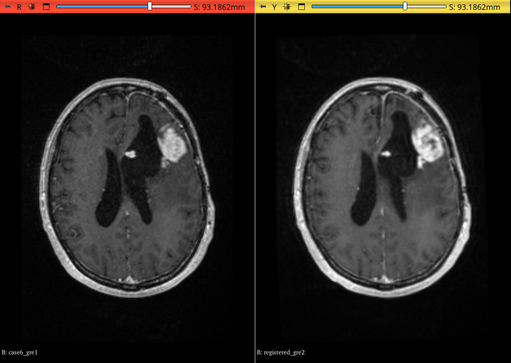
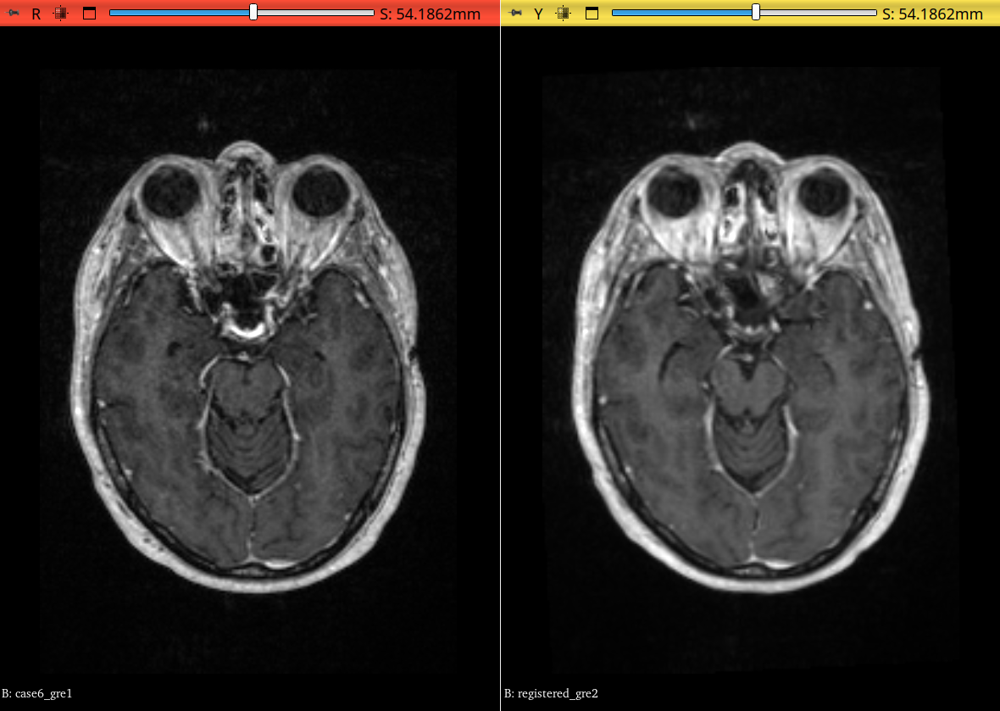
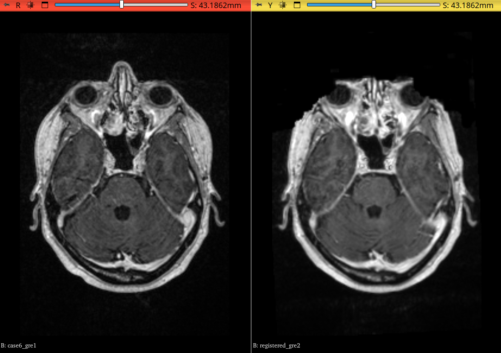
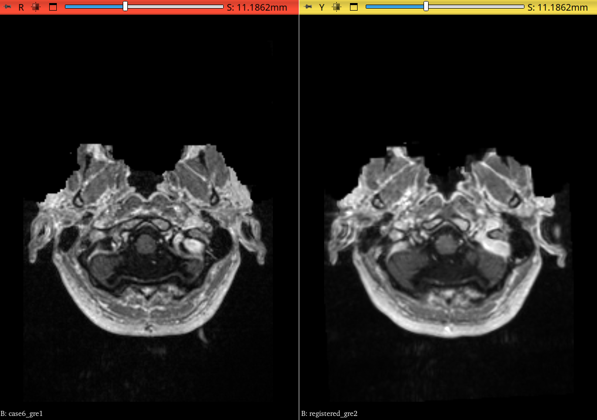

The volumes are mostly aligned, however we can see that some regions do not fit perfectly.

### Affine

#### Method

The AffineTransform applies a rotation, translation, scaling, and shearing operations.

The serialization of the optimizable parameters is an array of 12 elements.

- The first 3x3 elements correspond to the rotation matrix factors.
- The last 3 parameters defines the translation applied after the multiplication with the rotation matrix.
- We used :

- the optimizer [RegularStepGradientDescentOptimizer](https://itk.org/Doxygen/html/classitk_1_1RegularStepGradientDescentOptimizer.html) with
  - rotation matrix factors : 1.0
  - translation scale : 1.0e-3
  - maximum step length : 0.07
  - minimum step length : 1.0e-4
- the interpolator [LinearInterpolateImageFunction](https://itk.org/Doxygen/html/classitk_1_1LinearInterpolateImageFunction.html)

#### Result

In 1114 iterations (5 minutes), we got :

- the rotation matrix : [[1.0034078832836824, -0.0521164500104256, -0.0022650832680119024], [0.05082855102478259, 0.9945341090233035, -0.004249260973594543], [-0.0014057175612012004, 0.009367004286175975, 1.0217203731804303]]
- the translation X : -0.37068284427732734
- the translation Y : -0.37068284427732734
- the translation Z : -0.37068284427732734
- the optimizer's best metric value : 6666.25103637017

Here are some qualitative results :

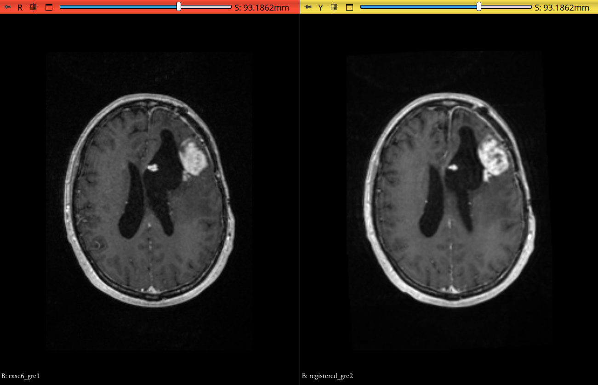
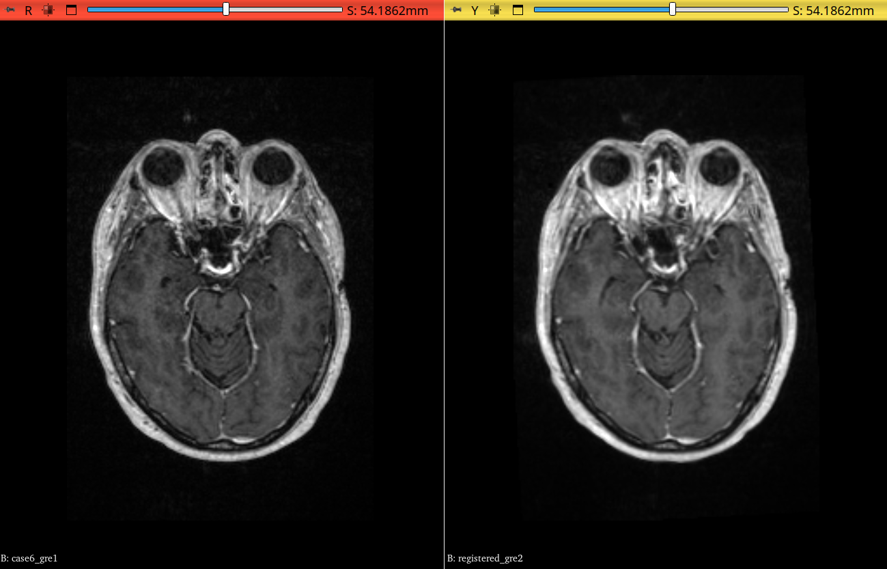
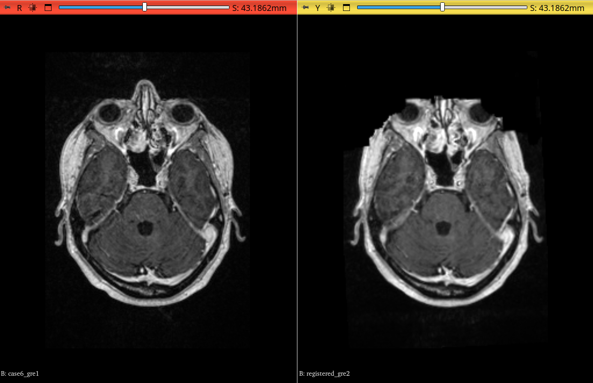
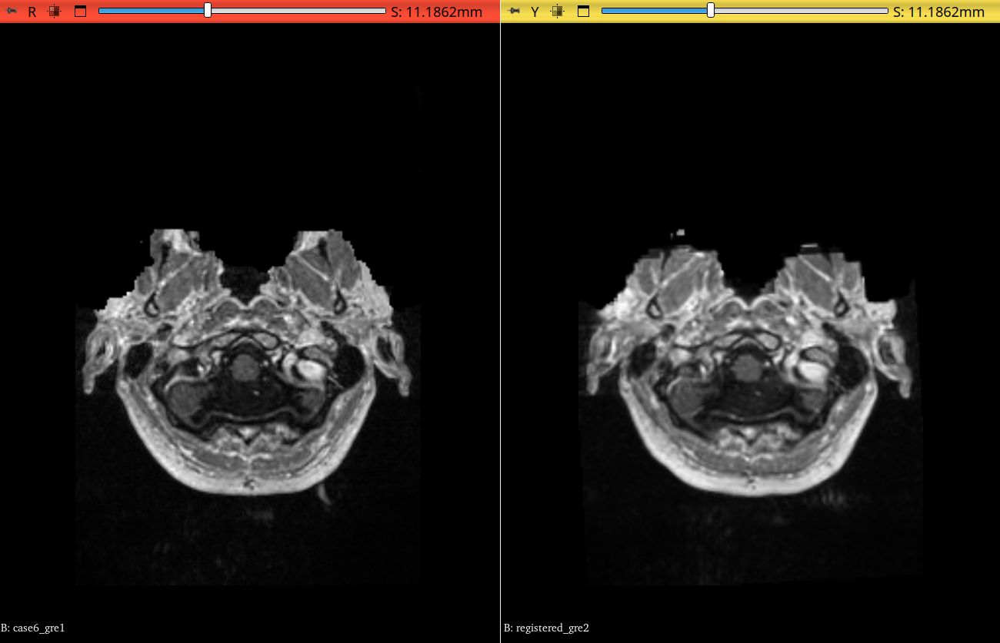

According to the MeanSquaresImageToImageMetric, the volumes are more aligned
compared to the result of the VersorRigid3DTransform.

We can see a small improvement on the third figure.

### B-Spline

#### Method

The BSplineTransform is a deformable image registration method using local deformations and a large parameter space.

However it requires a significant amount of computation time.

We used :

- the optimizer [LBFGSBOptimizerv4](https://itk.org/Doxygen/html/classitk_1_1LBFGSBOptimizerv4.html) with
  - UNBOUNDED mode
  - cost function convergence factor : 1.0e+12
  - gradient convergence tolerance : 1.0e-35
  - maximum number of function evaluation : 500
  - maximum number of corrections : 5

#### Result

In 210 iterations (1 hour and 32 minutes), we got :

- the optimizer's best metric value : 6249.509112153517

Here are some qualitative results :

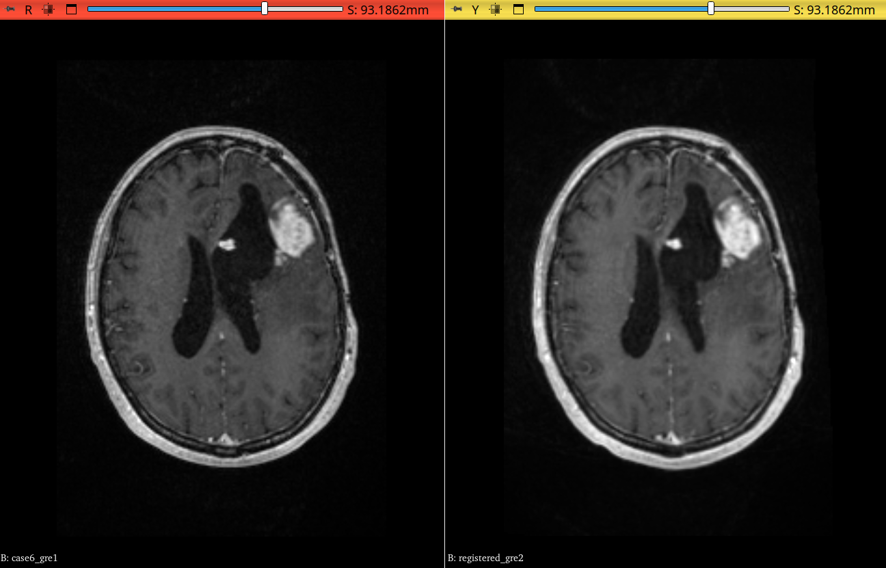
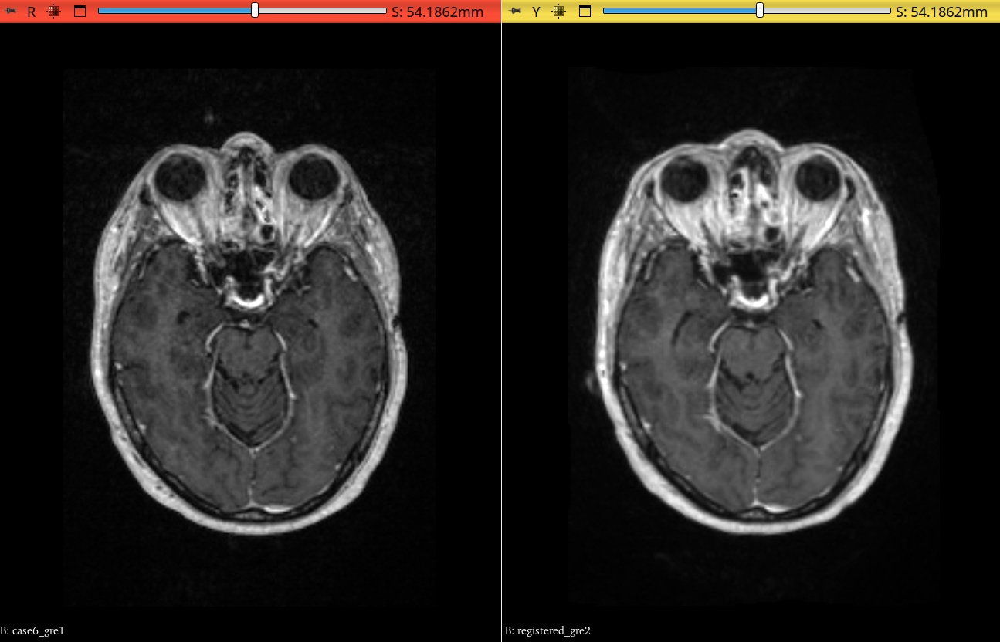
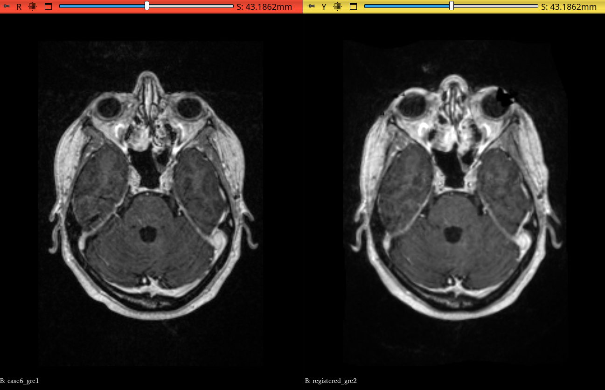
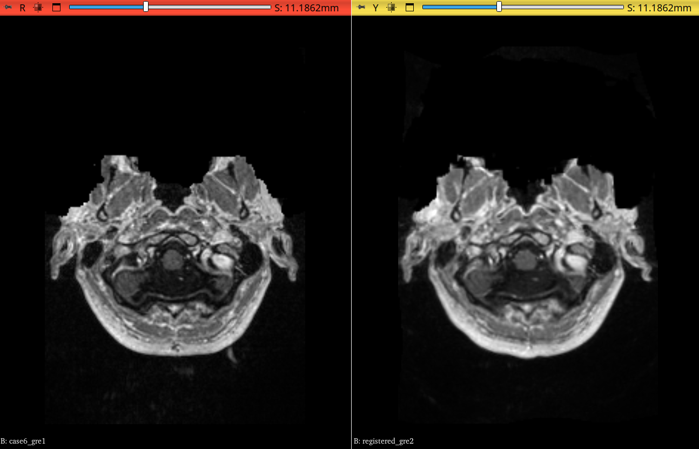

According to the MeanSquaresImageToImageMetric, the volumes are more aligned compared to the result of the AffineTransform.

We can see a small improvement on the third figure.

### Method selected

We selected the BSpline method as it has the best MeanSquare metric score.

However, it takes a large amount of computation time so we saved the registered image beforehand.

The `register.py` script can be run with a parameter to compute the registration with a specific method.

## SEGMENTATION

[Segmentation](https://itk.org/ITKSoftwareGuide/html/Book2/ITKSoftwareGuide-Book2ch4.html) consists of classifying every voxel of an image as either belonging to the background or a region of interest. In our case, we segmented the brain tumors of a patient at two different points in time.

By looking at the images, we have selected three components that we believe to be tumors.

We tested 4 different semi-automatic segmentation methods :

- [ConfidenceConnected](https://itk.org/Doxygen/html/classitk_1_1ConfidenceConnectedImageFilter.html)
- [ConnectedThreshold](https://itk.org/Doxygen/html/classitk_1_1ConnectedThresholdImageFilter.html)
- [IsolatedThreshold](https://itk.org/Doxygen/html/classitk_1_1IsolatedConnectedImageFilter.html)
- [ThresholdLevelSet](https://itk.org/Doxygen/html/classitk_1_1ThresholdSegmentationLevelSetImageFilter.html)

And one automatic one :

- [Watershed](https://itk.org/Doxygen/html/classitk_1_1WatershedImageFilter.html)

For each method, we explain their specificities and we analyze their result.

Finally, we select a final method for the segmentation.

### ConfidenceConnected

#### Method

The ConfidenceConnected method uses region growing to segment an image based on pixel intensity.

Starting from seed points, it iteratively includes neighboring pixels that fall within a specified confidence interval around the mean intensity of the region.

This interval is adjusted by a multiplier and the process repeats for a set number of iterations.

We used:

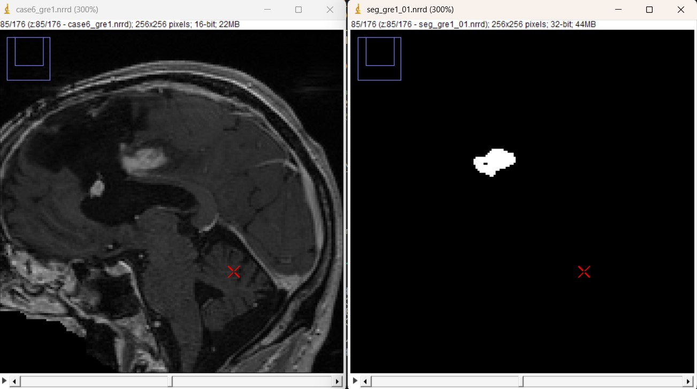

- **Smoothing method:** Curvature flow.
- **Parameters:** 4 iterations, multiplier of 2.5, neighborhood radius of 1.
- **Seeds:** (125, 64, 79), (99, 79, 83), (87, 67, 51) for GRE1 and (119, 81, 81), (98, 94, 81), (83, 68, 55) for GRE2.

#### Result

The ConfidenceConnected method successfully segmented the tumors but showed some limitations in defining clear boundaries.

The regions grew as expected around the seed points, but the method's dependency on the intensity range and iterations resulted in some under-segmentation.

Here are some qualitative results:

### ConnectedThreshold

#### Method

The ConnectedThreshold method segments an image by including all connected pixels that fall within a specified intensity range.

Starting from a seed point, it grows the region by adding neighboring pixels that have intensities within the lower and upper threshold values.

We used:

- **Smoothing method:** Gradient anisotropic diffusion.
- **Parameters:** Lower threshold and upper threshold values (provided during segmentation).
- **Seed:** (provided during segmentation).

#### Result

The ConnectedThreshold method provided reasonable segmentation results for regions with distinct intensity values within the specified thresholds.

However, it struggled with accurately segmenting regions with overlapping intensity ranges, leading to some parts of the tumors being missed or incorrectly included.

Here are some qualitative results:

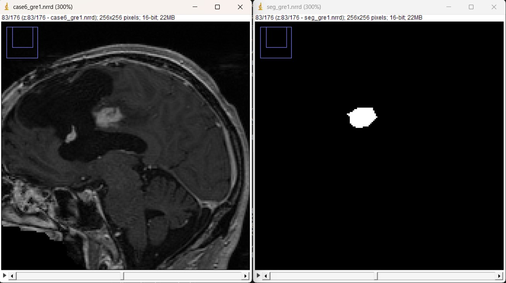

### IsolatedThreshold

#### Method

The IsolatedThreshold method segments an image by growing regions from two seed points.

It ensures that the regions do not touch or merge by maintaining a specified intensity range. This method is useful for separating closely situated structures.

We used:

- **Smoothing method:** Curvature flow.
- **Parameters:** Lower threshold of 395.
- **Seeds:** (125, 64, 79) and (126, 55, 79) for GRE1; (120, 77, 83) and (154, 89, 83) for GRE2.

#### Result

The IsolatedThreshold method performed well in separating closely situated structures.

By using two seed points and maintaining a lower intensity threshold, it effectively segmented the tumors with minimal over-segmentation.

The boundaries were generally well-defined, but the method was sensitive to the selection of seed points and the intensity threshold.

Here are some qualitative results:

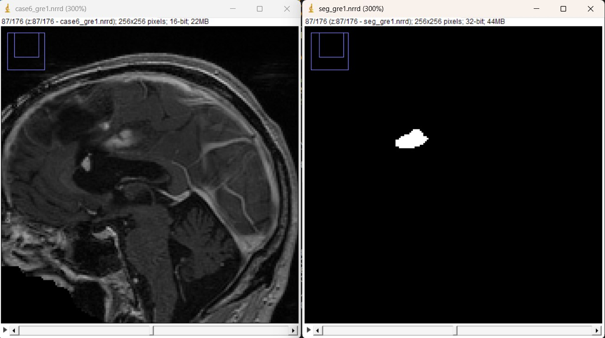

### ThresholdLevelSet

#### Method

The ThresholdSegmentationLevelSetFunction function is a subclass of the [LevelSetFunction](https://itk.org/Doxygen/html/classitk_1_1LevelSetFunction.html). It is useful for segmentations based on intensity values in an images.

It constructs a feature image with positive values inside an intensity window and negative values outside.

Then, the evolving level set locks onto regions close to the boundaries of the intensity window.

Finally, seeds are given as input to the filter and are converted into a level set embeddding. They are then propagated according to the features calculated from the image.

We used :

- [BinaryThresholdImageFilter](https://itk.org/Doxygen/html/classitk_1_1BinaryThresholdImageFilter.html) with
  - lower threshold : -4.0
  - upper threshold : 0.0
  - outside value : 0
  - inside value : 255
- [ThresholdSegmentationLevelSetImageFilter](https://itk.org/Doxygen/html/classitk_1_1ThresholdSegmentationLevelSetImageFilter.html) with
  - propagation scaling : 1.0
  - maximum root mean squared error : 0.02
  - number of iterations : 1500
  - upper threshold : 1000.0
  - lower threshold : 400.0
  - iso surface value : 0.0
- [FastMarchingImageFilter](https://itk.org/Doxygen/html/classitk_1_1FastMarchingImageFilter.html) with
  - speed constant : 1.0
  - seeds : [[98, 79, 83], [86, 66, 51], [123, 66, 82]]

#### Result

The segmentation is well done for all the tumors. In particular, compared to other the results of the other segmentation methods tried, the boundaries are more accurate.

Here are some qualitative results :

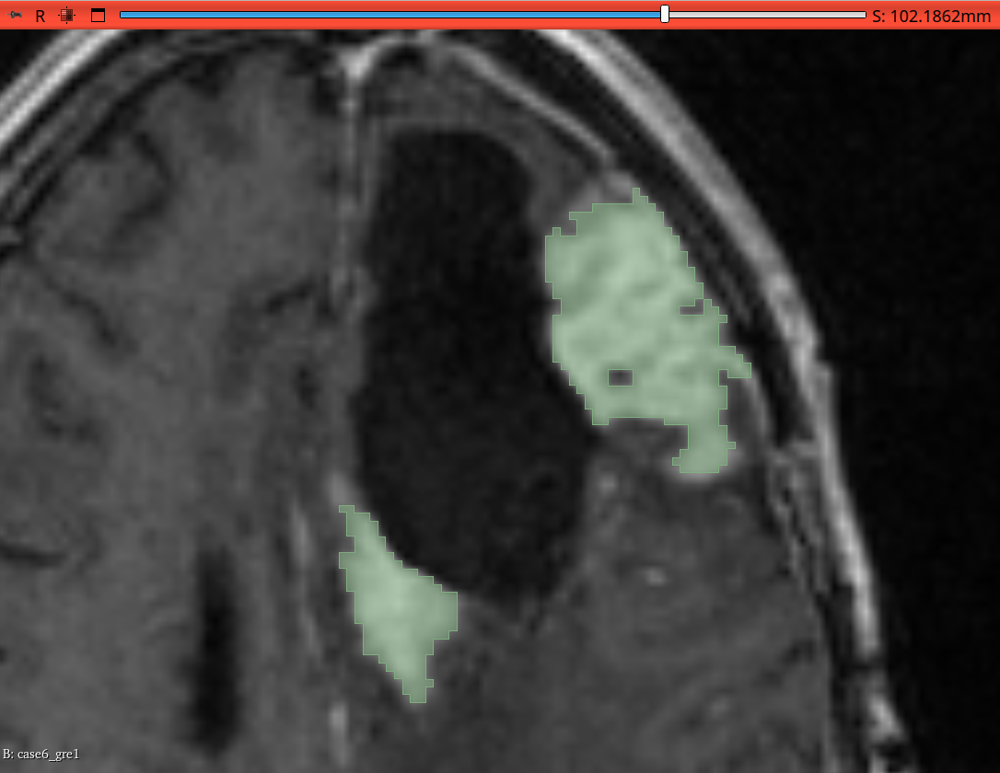
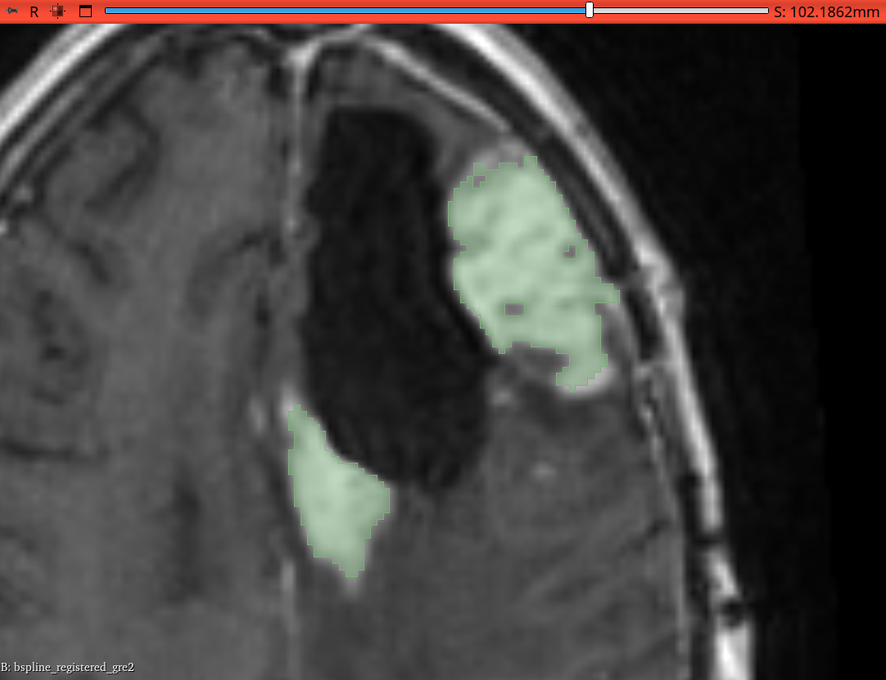

### Watershed

#### Method

The Watershed method segments an image by treating it as a topographic surface and simulating water rising from seed points.

Regions where water from different sources would meet are defined as boundaries.

This method often involves preprocessing steps like computing the gradient magnitude to highlight edges.

- This method is fully automatic and provides an array of segmented objects. These objects need then to be filtered by selecting the ones of interest.

We used:

- **Smoothing method:** Gradient anisotropic diffusion.
- **Parameters:** Threshold of 0.01, level of 0.2, minimum object size of 100.

#### Result

The Watershed method delivered accurate segmentation results with well-defined boundaries.

It effectively highlighted edges and segmented the tumors.

The preprocessing steps and parameter tuning played a crucial role in achieving precise segmentation.

This method showed superior performance compared to others, especially in terms of boundary accuracy and object separation.

However, some under-segmentation is noticeable. Specifically, the third large tumor could not be segmented in the `case6_gre1.nrrd` file, resulting in several small, separated regions that were not satisfactory even when recombined.

Here are some qualitative results:

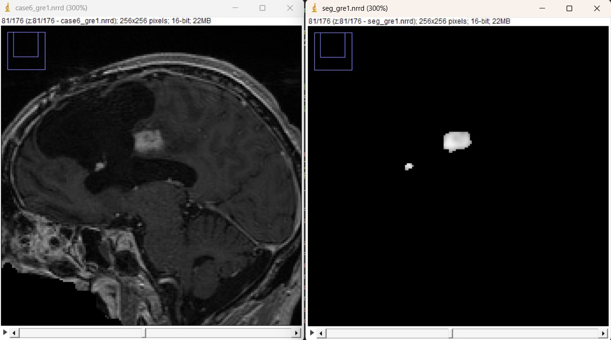

### Method selected

We selected the Threshold Level Set method as the segmentation was the most accurate we could get.

It could segment the three components we selected on both images. And the boundaries are well defined for all of them.

## VISUALIZATION

There is in total 7 windows, 6 for the visualization of the MRI and tumor, 1 for the quantitative results.

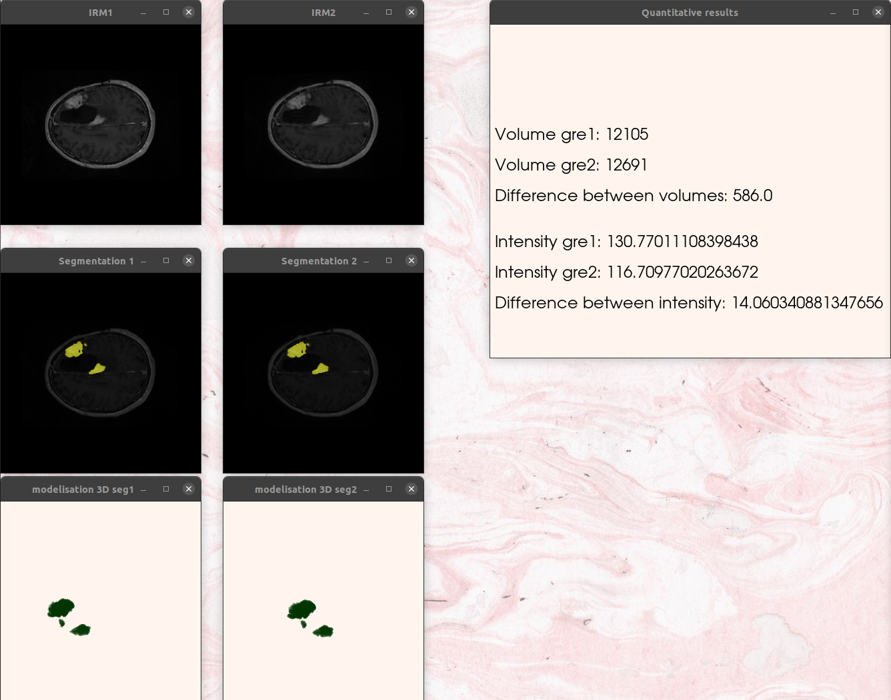

The first column is composed of 3 windows:

- The MRI GRE1 in axial view
- The MRI GRE1 with a mask to see the segmentation of the tumor in axial view
- The segmentation of the tumor in 3D

The second column is composed of 3 windows:

- The MRI GRE2 in axial view
- The MRI GRE2 with a mask to see the segmentation of the tumor in axial view
- The segmentation of the tumor in 3D

All the windows in axial view are connected between them, when the user clicks on the left button of their mouse and moves it up-down or left-right hey can access the same slice of the MRI in the 4 windows.

The two 3D render of the tumor windows are also connected.

Finally the last window only have text that shows the results.

We can see that the intensity of the gre1 tumor is bigger than the gre2's one. We suppose that it can be explain by the fact that we may over segment the gre1's tumor.
